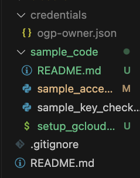

## 環境構築
### Anacondaでpython環境を構築するときのコマンド
```
chmod +x setup_gcloud_env.sh
./setup_gcloud_env.sh
conda activate gcloud-token
```

### sample_access_cs.pyの動かし方
1. credentials/ogp-owner.jsonを作る
2. ogp-owner.jsonにdiscordで送られてきたコード貼り付け
3. `python sample_access_cs.py` でpngが取ってこれればOK
   
